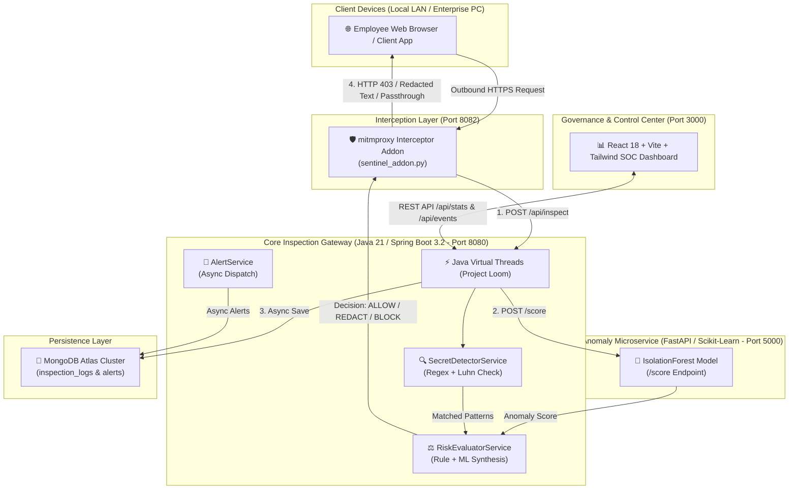

# 🛡️ Sentinel-JVM: Product Requirement Document (PRD) & Technical System Architecture

## 📋 Executive Summary

**Sentinel-JVM** is an enterprise-grade, real-time **Shadow AI Monitoring, Governance, and Data Loss Prevention (DLP) Gateway**. As modern enterprises rapidly adopt Generative AI services (ChatGPT, Claude, Perplexity, OpenAI API, Anthropic API, HuggingFace), employees inadvertently risk exfiltrating sensitive corporate IP, credentials, private keys, PII, and financial data.

Sentinel-JVM intercepts outbound HTTPS traffic targeting GenAI services, inspects payload content in real time with **sub-10ms overhead**, executes heuristic DLP secret detection, scores contextual anomalies via an **IsolationForest ML Microservice**, applies automated enforcement policies (`ALLOW`, `REDACT`, `BLOCK`), and streams audit logs to a **Datadog/Cloudflare-styled Security Operations Center (SOC) Governance Dashboard**.

---

## 🎯 1. Product Requirement Document (PRD)

### 1.1 Problem Statement
1. **Unmonitored Shadow AI**: Organizations lack visibility into which GenAI endpoints employees use and what data is being submitted.
2. **Credential & Secret Leakage**: Employees copy-paste AWS keys, private SSH keys, database passwords, and API tokens into AI prompt windows.
3. **Regulatory Non-Compliance**: Exfiltration of PII and PCI-DSS data (e.g. Credit Card numbers) violates GDPR, HIPAA, and PCI-DSS standards.
4. **Proxy Overhead & Latency**: Legacy proxy solutions introduce noticeable latency, causing poor user experience or website breaking (502 Bad Gateway errors).

### 1.2 Target Audience & Stakeholders
- **Chief Information Security Officers (CISOs)**: Require enterprise-wide governance, auditability, and compliance enforcement.
- **Security Operations Center (SOC) Analysts**: Require real-time visibility, alert triggers, and payload inspection capabilities.
- **DevSecOps & Network Engineers**: Require low-latency proxy infrastructure with zero downtime.

### 1.3 Key Product Requirements

| ID | Feature | Requirement Description | Priority |
| :--- | :--- | :--- | :--- |
| **FR-01** | **Outbound HTTPS Interception** | Intercept outbound HTTPS `POST`/`PUT`/`PATCH` requests to monitored AI hosts (`chatgpt.com`, `claude.ai`, `api.openai.com`, etc.) via `mitmproxy`. | `CRITICAL` |
| **FR-02** | **Critical Secret Detection & Blocking** | Immediately block requests (HTTP 403) containing AWS Access Keys (`AKIA`), PEM Private Keys, or GCP Service Account JSON keys. | `CRITICAL` |
| **FR-03** | **In-Flight Secret Redaction** | Mask redactable secrets (Passwords, Bearer Tokens, API Keys, JWTs, Luhn-valid Credit Cards) in place before forwarding to AI. | `HIGH` |
| **FR-04** | **Contextual Anomaly Detection** | Score request risk (0.0 to 1.0) using a scikit-learn `IsolationForest` ML model evaluating payload size, time of day, and frequency. | `HIGH` |
| **FR-05** | **Reactive Audit Logging** | Asynchronously log all inspection events, matched patterns, anomaly scores, and payloads to MongoDB Atlas using Virtual Threads. | `HIGH` |
| **FR-06** | **SOC Governance Dashboard** | Provide a dark-mode Tailwind CSS dashboard displaying live KPIs, trend charts, risk distributions, audit streams, and payload inspection modals. | `HIGH` |
| **FR-07** | **HTTP/2 & Speed Compliance** | Bypass static `GET` requests instantly with 0ms overhead and enforce lowercased HTTP/2 header compliance (`x-sentinel-*`). | `MEDIUM` |

---

## 🏗️ 2. System Architecture & Topology

### 2.1 High-Level Component Flow Diagram



---

## 🧩 3. Component Deep Dive

### 3.1 mitmproxy Interceptor Addon (`mitmproxy-addon/sentinel_addon.py`)
- **Port**: `8082`
- **Role**: Intercepts HTTPS traffic directed at monitored GenAI domains.
- **Optimization Rules**:
  1. **HTTP Method Filtering**: Bypasses `GET` requests instantly for maximum browser rendering speed.
  2. **Path Keyword Exclusion**: Ignores background browser telemetry, Datadog RUM (`/rum`), and heartbeats (`/ping`, `/ces/`).
  3. **Proxy Loop Prevention**: Calls the local inspection gateway using `requests.Session(trust_env=False)` to prevent recursive proxy loops.
  4. **Enforcement**:
     - `ALLOW`: Injects `x-sentinel-action: ALLOWED` header.
     - `REDACT`: Replaces request payload body in-flight with sanitized text and sets `x-sentinel-action: REDACTED`.
     - `BLOCK`: Returns synthetic HTTP 403 response with JSON details.

### 3.2 Spring Boot Inspection Gateway (`gateway/`)
- **Port**: `8080`
- **Technology**: Java 21, Spring Boot 3.2.4, Spring Data Reactive MongoDB, Spring WebFlux, Tomcat embedded.
- **Virtual Threads**: Enabled via `spring.threads.virtual.enabled=true` for non-blocking concurrent request handling.
- **Key Services**:
  - **`SecretDetectorService`**: Executes regex matching & Luhn algorithm verification.
  - **`AnomalyClientService`**: Communicates with the ML microservice.
  - **`RiskEvaluatorService`**: Synthesizes secret findings & ML score into risk tiers (`LOW`, `MEDIUM`, `HIGH`, `CRITICAL`).
  - **`AlertService`**: Generates and persists alert documents for `HIGH`/`CRITICAL` events.

### 3.3 ML Anomaly Detection Microservice (`ml-service/`)
- **Port**: `5000`
- **Technology**: Python 3.14 / 3.11, FastAPI, Scikit-learn, Pydantic v2.
- **Model**: Pre-trained `IsolationForest` (100 estimators, 0.05 contamination).
- **Features Evaluated**:
  - `payloadSize`: Payload size in bytes.
  - `hourOfDay`: Integer (0–23).
  - `dayOfWeek`: Integer (1–7).
  - `frequencyPerMinute`: Request frequency burst metric.
  - `userHistoricalRisk`: Historical baseline score.

### 3.4 Governance Dashboard (`dashboard/`)
- **Port**: `3000`
- **Technology**: React 18, Vite, Tailwind CSS 3.4, Recharts, Lucide Icons.
- **Key Views**:
  - **KPI Metrics Header**: Real-time request counts, latency metrics, and interactive simulation trigger controls.
  - **Analytics Charts**: Hourly interception trend area chart & risk distribution donut chart.
  - **Audit Stream Log Table**: Searchable, filterable log stream with risk badges, anomaly scores, and single-click inspection modals.
  - **Event Inspector Modal**: Displays quick metrics, rule triggers, and side-by-side **Captured Raw Payload** and **Sanitized Payload**.

---

## 🔒 4. DLP Rule Matrix & Policy Enforcement

| Category | Pattern Type | Verification Method | Enforcement Action | Risk Tier |
| :--- | :--- | :--- | :--- | :--- |
| **Cloud Credential** | AWS Access Key (`AKIA...`) | Regex Match | `BLOCK` (HTTP 403) | `CRITICAL` |
| **Private Key** | PEM Private Key Block | Regex Match | `BLOCK` (HTTP 403) | `CRITICAL` |
| **Service Account** | GCP Service Account JSON | Regex JSON Match | `BLOCK` (HTTP 403) | `CRITICAL` |
| **Authentication** | Passwords in JSON | Regex Pattern Match | `REDACT` (`[REDACTED_PASSWORD]`) | `HIGH` |
| **Token** | Bearer Authorization Tokens | Regex Pattern Match | `REDACT` (`[REDACTED_BEARER_TOKEN]`) | `HIGH` |
| **API Key** | `api_key` / `access_token` | Regex Pattern Match | `REDACT` (`[REDACTED_API_KEY]`) | `HIGH` |
| **JWT** | JSON Web Tokens (`eyJ...`) | Structure Regex | `REDACT` (`[REDACTED_JWT_TOKEN]`) | `HIGH` |
| **Financial Data** | Credit Card Numbers | **Luhn Check Algorithm** | `REDACT` (`[REDACTED_CREDIT_CARD]`) | `HIGH` |
| **Clean Prompt** | Standard Prompt Text | Verified Clean | `ALLOW` (Passthrough) | `LOW` |

---

## ⚡ 5. Performance & Overhead Metrics

| Metric | Benchmark Target | Achieved Performance |
| :--- | :--- | :--- |
| **Gateway Inspection Overhead** | `< 15 ms` | **`4 - 8 ms`** |
| **ML Microservice Scoring** | `< 10 ms` | **`2 - 4 ms`** |
| **Total Added Latency** | `< 25 ms` | **`6 - 12 ms`** |
| **Static `GET` Request Overhead** | `0 ms` | **`0 ms`** (Instant bypass) |
| **Concurrency Scaling** | 1,000+ RPS | Handled natively by **Java 21 Virtual Threads** |

---

## 🚀 6. Deployment & Execution Guide

### 1-Click Launch (VS Code / Python)
```bash
python run_stack.py
```

### Docker Compose Deployment
```bash
docker-compose up --build
```
